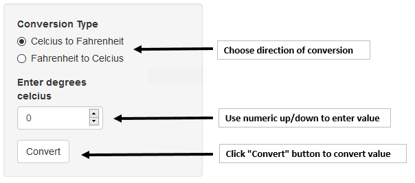
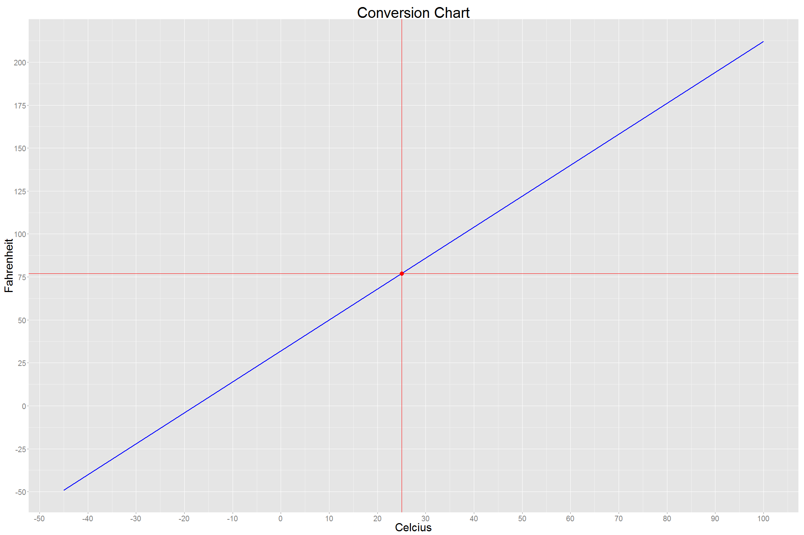

### TEMPERATURE CONVERSION APP

$^{\circ} C <=> ^{\circ} F$  

Christie Myburgh

--- 

## Main Features

1. Ease of use.
  
2.  Correct conversion formulas.

3. Graphical representation of results.

--- 

## Ease of Use

---

## Conversion Formulas

* Celcius to Fahrenheit

$^{\circ} F = ^{\circ} C * (9/5) + 32$

* Fahrenheit to Celcius

$^{\circ} C = (^{\circ} F  - 32) * (5/9)$

--- 

## Graphical Representation

1. Blue line represent Celcius - Fahrenheit relationship

2. Red point represent user's converted value.

 

